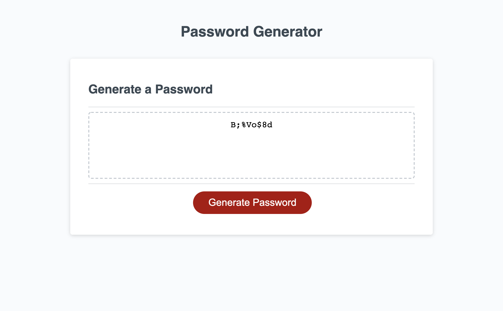

# Password Generator

<!-- TABLE OF CONTENTS -->
<details open="open">
  <summary>Table of Contents</summary>
  <ol>
    <li>
      <a href="#about-the-project">About The Project</a>
      <ul>
        <li><a href="#built-with">Built With</a></li>
      </ul>
    </li>
    <li>
      <a href="#getting-started">Getting Started</a>
    </li>
    <li><a href="#code-snippet">Code-Snippet</a></li>
    <li><a href="#license">License</a></li>
    <li><a href="#contact">Contact</a></li>
    <li><a href="#acknowledgements">Acknowledgements</a></li>
  </ol>
</details>


<!-- ABOUT THE PROJECT -->
## About The Project



For this assignment, I had to create a random password generator using javascript. The html and css were provided already but I was primarily just dealing with javascript. Following certain request for the user, such as, would the user like to include lowercase, uppercase, numbers, and/or special character to generate a password and random. I also learned during this assignment why password generators were important and here's why:

Here's why:
* Only you have access and know the password!
* Your data is so important and without a generator, once one of your data is compromised, they all are!
* Constantly update your password and make sure it's something other people can't guess, use a password generator!

Of course, making this generator wasn't easy. It tested my previous knowledge and made we constantly researching to ensure I had the best product I could deliver to the user!

The websites I used to help create my generator are listed below in the <a href="#acknowledgements">acknowledgements</a>.

### Built With

For what I coded and was assigned, I only used and needed javascript:
* [Javascript](https://www.javascript.com/)


<!-- GETTING STARTED -->
## Getting Started

To get a unique password, click 'Generate Password' in the red box. Follow the prompted question above to create a password of your likings and click 'done' when finish answering the questions. A password will be displayed where you can copy it from the fielded box!


<!-- USAGE EXAMPLES -->
## Code Snippet

While coding this generator, this piece of code below became the hardest to figure out. I had to create a new function that would calcualte the requested length of the password and display the correct amount. I then used a "for" loop to generatr a password and push the password in the display. The ".join" would display the generated password without commas.

```
function getRandom(arr) {
    var randomIndex = Math.floor(Math.random() * arr.length);
    var element = arr[randomIndex]
    return element
  }

  for (var i = 0; i < passwordLengthUser; i++) {
    var randomChar = getRandom(passwordChar)
    password.push(randomChar)
    console.log(password)
  }
  return password.join("")
```


<!-- LICENSE -->
## License

Distributed under the MIT License. See `LICENSE` for more information.


<!-- CONTACT -->
## Contact

Sami Khawja - Skhawja11@gmail.com

Project Link: [GitHub](https://github.com/samikhawja/password_generator)

Live Link: [Password Generator](https://samikhawja.github.io/password_generator/)


<!-- ACKNOWLEDGEMENTS -->
## Acknowledgements
* Taylor Hackbart
* [W3Schools](https://www.w3schools.com/)
* [StackOverflow](https://stackoverflow.com/)
* [Mozilla](https://developer.mozilla.org/en-US/docs/Web/JavaScript)